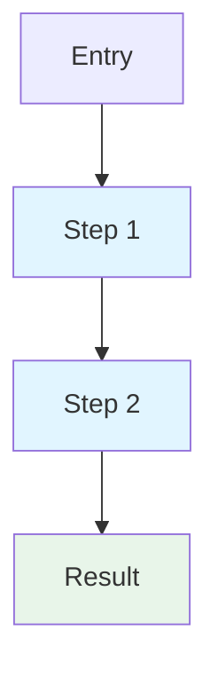
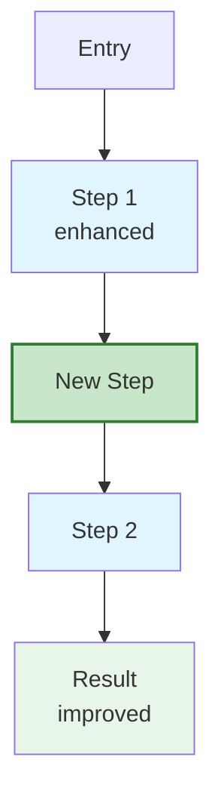

# Task: Create a concise diff trace for PR comment and post it

You are analyzing the differences between the base branch and the current branch, generating a focused markdown trace, and posting it as a PR comment.

## CRITICAL: Accuracy Requirements

**You MUST only reference code that actually exists in the codebase:**
1. Before mentioning any function, command, file, or API endpoint, verify it exists
2. Use git diff and file reads to see what actually changed
3. Never invent commands, functions, or behavior that don't exist
4. Quote actual code when describing changes
5. Verify line numbers match the current branch

**Verification checklist:**
- [ ] All mentioned commands exist (search in cmd/ directories)
- [ ] All function names were found via Grep or in diffs
- [ ] All file paths were confirmed via git diff or Glob
- [ ] Changes described match actual diff output

Remember: It's better to say "I couldn't find X" than to hallucinate.

## Process

### Step 1: Identify Base Branch and PR

1. Run `git status` to get current branch name
2. Run `git merge-base --fork-point main HEAD` to find merge base
   - If that fails, try `git merge-base main HEAD`
3. Check if a PR exists: `gh pr view --json number,url`
4. Get repository info: `gh repo view --json owner,name` and `git rev-parse HEAD` for permalinks

### Step 2: Discover and Analyze Changes

1. Run `git diff --name-only <merge-base>...HEAD` for changed files
2. Run `git diff <merge-base>...HEAD` for specific files to see actual changes
3. Read current versions of modified files
4. Identify the core change and its ripple effects

### Step 3: Determine What Sections to Include

**Always include:**
- Implementation Details (core technical changes)

**Include only if relevant:**
- Flow Diagrams (only if algorithm/flow actually restructured)
- Breaking Changes (only if public API affected)
- Impact (only if performance/compatibility concerns exist)

**Never include:**
- Changed Files (GitHub shows this)
- Helper Functions listings
- Empty sections

## GitHub Permalink Format

**IMPORTANT**: Use GitHub permalink format for all file references.

Format:
```
https://github.com/OWNER/REPO/blob/COMMIT_SHA/path/to/file.rs#L123
```

Shorter relative format:
```
[`filename.rs:123`](../../blob/COMMIT_SHA/path/to/file.rs#L123)
```

How to construct:
1. Get commit SHA: `git rev-parse HEAD`
2. Get repo info: `gh repo view --json owner,name`
3. Format: `https://github.com/{owner}/{name}/blob/{sha}/{path}#L{line}`

## Output Format

Generate focused markdown suitable for PR comments:

```markdown
## Technical Analysis

⚠️  Auto-generated by Claude Code - verify critical details against source code

---

## Implementation Details

Group changes by impact/purpose rather than technical category. For each major change:

### Change Title (e.g., "Per-artifact target directory tracking")

[`old-location.rs:123`](link) → [`new-location.rs:456`](link)

**What changed:**
Brief description of the change in user terms.

**Why:**
The motivation - what problem does this solve or what does it enable?

**Implementation:**
Key technical details (new fields, refactored functions, changed behavior).

---

## Flow Diagrams

⚠️ ONLY include this section if there's actual flow restructuring worth visualizing.

For each restructured flow:

### Pipeline: Name of the Flow

**Before:**



**After:**



**Key differences:**
- 🆕 New step added
- ⚡ Enhanced behavior
- 📦 Improved result

---

## Breaking Changes

⚠️ ONLY include this section if there are actual public API breaking changes.

### CLI Command: `command-name`

**What changed:**
The user-facing change (e.g., flag removed, different output).

**Impact:**
How this affects users.

**Migration:**
How to adapt (if applicable).

---

### API Endpoint: `POST /api/v1/endpoint`

**What changed:**
Request/response schema change or behavior change.

**Impact:**
How this affects API consumers.

**Migration:**
How to adapt.

---

## Impact

⚠️ ONLY include this section if there are noteworthy performance or compatibility concerns.

### Performance

Expected changes (positive or negative) with reasoning.

### Compatibility

- Cache/state format changes requiring migration
- API protocol changes
- Breaking on-disk format changes

---

## Technical Details

<details>
<summary>Expand for additional technical context</summary>

### Data Structures

For significant type changes:

**TypeName** ([`file.rs:line`](link))
- Added: `field_name: Type` - Purpose
- Modified: `field_name: OldType → NewType` - Why
- Removed: `field_name` - Why

### Function Signatures

For significant signature changes:

**`function_name()`** ([`file.rs:line`](link))
- Before: `(old_params)`
- After: `(new_params)`
- Why: Reason for the change
- Call sites: Major callers affected

### Dependencies

- Added: `crate-name` - Why
- Removed: `crate-name` - Why
- Updated: `crate-name: 1.0 → 2.0` - Breaking changes if any

</details>
```

## Guidelines

**Content:**
- Focus on **implementation details** - the PR description already covers high-level "why"
- Explain **how** the changes work, not just **what** changed
- Group related changes together by technical area
- Use expanding sections (`<details>`) for optional depth
- Be concise but technical - this is for reviewers who want implementation details

**Formatting:**
- All file references must be GitHub permalinks
- Use emoji sparingly (only in "Key differences" of diagrams)
- Code/paths in backticks: `filename.rs`
- Use `<details>` for deep technical content

**Diagrams:**
- Only create when flow/algorithm actually restructured
- Don't diagram simple function signature changes
- Keep diagrams focused (5-10 nodes max)
- Always show before/after comparison

## Breaking Changes Definition

**PUBLIC API breaking changes only:**
- CLI commands: Removed/renamed commands or flags
- CLI behavior: Same command, different output/behavior
- API routes: Removed/changed endpoints or schemas
- API behavior: Same endpoint, different behavior

**NOT breaking changes:**
- Internal function signatures
- Internal data structures
- Module reorganization
- Private helper functions

## Mermaid Diagram Styling

**Node colors:**
- Blue (`#e1f5ff`) - existing functions
- Green (`#c8e6c9`) - new additions
- Yellow (`#fff4e1`) - data/state
- Light green (`#e8f5e9`) - results

**Emoji in key differences:**
- 🆕 New additions
- ⚡ Enhancements
- ✏️ Modifications
- 📦 Results
- ⚠️ Breaking changes

## Final Checks Before Posting

**Accuracy:**
1. Verify all file references use GitHub permalinks with current HEAD SHA
2. Confirm all mentioned commands/functions exist
3. Ensure changes described match actual diffs
4. Remove any uncertain claims or mark as "[unverified]"

**Relevance:**
1. Remove "Breaking Changes" section if no public API changes
2. Remove "Flow Diagrams" if no actual flow restructuring
3. Remove "Impact" section if no performance/compatibility concerns
4. Remove any empty subsections

**Quality:**
1. Mermaid diagrams have valid syntax
2. All code wrapped in backticks
3. Headings use proper markdown (`##`)
4. No redundant sections

## Posting the Comment

After generating the markdown:

1. Get repository info:
   ```bash
   gh repo view --json owner,name
   git rev-parse HEAD
   ```

2. Write markdown to temporary file

3. Post comment:
   ```bash
   gh pr comment --body-file <temp-file-path>
   ```

4. Report success:
   - "✅ Posted trace comment to PR #123"
   - Include PR URL

5. On failure: provide markdown to user for manual posting

Begin your trace generation and posting now.
